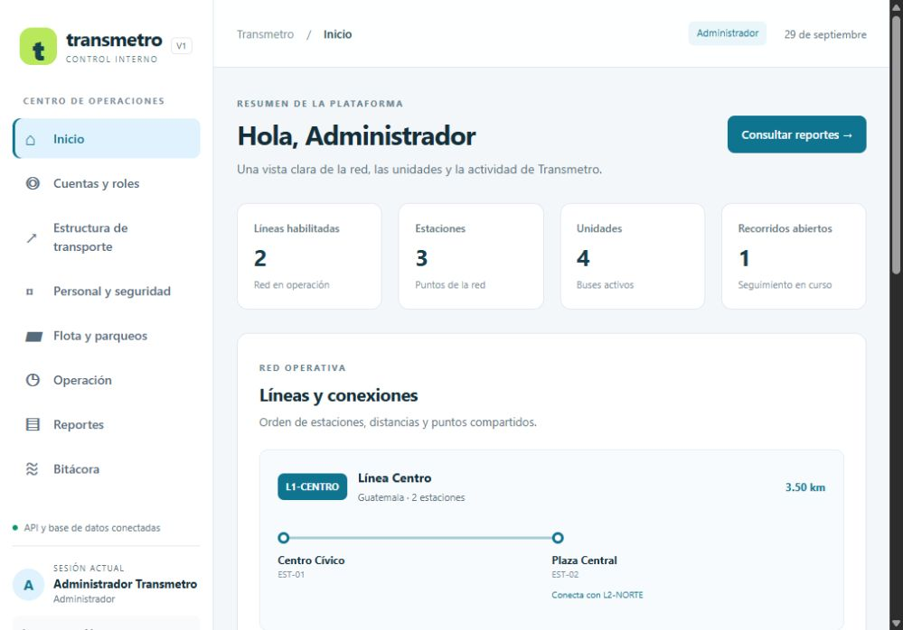
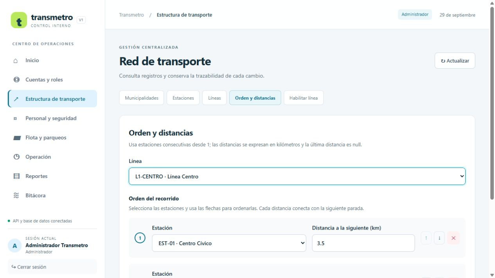
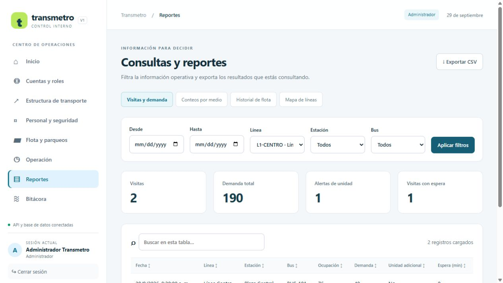

# Comparación de implementaciones

Se compara el proyecto existente `TRASNMETRO` con `TRANSMETROV1`, con una copia inicial de los mismos datos en bases independientes desde la adaptación al SQL original. La versión anterior queda disponible en 5173 y V1 en 5174 si ambos servidores están iniciados.

| Aspecto | TRASNMETRO | TRANSMETROV1 |
| --- | --- | --- |
| Estructura | backend/frontend | Misma separación y lenguajes |
| Navegación | Estado interno del panel | Rutas por módulo, enlaces y soporte del historial del navegador |
| Diseño | Panel compacto con texto pequeño | Barra lateral blanca inspirada en Lavandería, jerarquía tipográfica, superficies claras y navegación adaptable |
| Sesión | Datos y cierre de sesión | Sesión fija al pie de la barra lateral, rol en barra superior, cookie independiente y redirección al expirar |
| Relaciones | Introducción manual de IDs | Selectores con código/nombre de los registros reales |
| Orden de estaciones | Campo JSON | Editor de paradas, flechas, kilómetros, control de duplicados y total previo |
| Catálogos | Creación/configuración y detalle JSON | Formularios en diálogo, edición de registros principales y tablas con relaciones legibles |
| Tablas | Listado completo y tarjetas duplicadas | Búsqueda local, ordenamiento y paginación de diez filas |
| Mapa | SVG con códigos | Esquema de líneas con nombres, kilómetros y conexiones explícitas |
| Operación | Selección sin estado del bus | Buses ocupados deshabilitados, siguiente estación según permisos, previsión de las dos reglas y detalle de visitas |
| Errores de guardado | Limpiaba campos después de fallar | Conserva datos para corregir y volver a intentar |
| Cancelación | Sin acción visible | Confirmación explícita y conservación de visitas previas |
| Reportes | Consultas sin controles de filtros/CSV | Filtros por reporte, métricas y exportación CSV del resultado cargado |
| Totales de alertas | Solo sobre primeras 1000 visitas | Conteos sobre todos los resultados y aviso de límite del detalle |
| Conteos por medio | Agregación sobre primeras 5000 filas | GROUP BY en MySQL sin recortar el total |
| Alta de red | Bloqueaba estaciones nuevas al vincular | Permite estaciones en preparación y las habilita con su primer vínculo |
| Fechas/cierres | Períodos sin validación y cierre implícito | Fechas válidas, períodos coherentes y estado de cierre explícito |
| Visitas | Sin comprobar fecha contra el inicio/anterior | Rechaza fechas anteriores al inicio o a la visita previa |
| Instalación manual | Migración separada y seed | SQL de base, tablas e INSERT locales, con explicación de historial Prisma |
| Dependencias | Bibliotecas QR no utilizadas, 10 alertas backend | Bibliotecas innecesarias retiradas y 6 alertas backend tras actualización compatible |
| Pruebas automáticas | 15 pruebas backend | 32 backend y 2 CSV |

## Cómo comparar

1. Inicia ambas versiones, cada una en sus puertos. V1 no sustituye los procesos de la original.
2. Usa la misma cuenta en ambas y consulta las mismas líneas y estaciones.
3. En V1 abre Transporte → Orden y distancias; comprueba que ya no necesita IDs ni JSON. Puedes revisar el editor sin guardar.
4. Abre Reportes, aplica un período y exporta CSV. Revisa la información de límite de detalle.
5. Inicia sesión como operador para comparar su flujo; como administrativo, comprueba que no hay botones de escritura.

Los cambios son mejoras verificables de esta implementación. No constituyen una medición controlada de la calidad de los modelos: el selector del chat es del usuario y no se verifica desde el proyecto. No hay benchmark de velocidad, accesibilidad ni concurrencia que permita atribuir diferencias numéricas a un modelo específico.

## Límites pendientes de validación

La compilación y pruebas automatizadas pasaron. Se verificaron visualmente login, dashboard con datos, editor de una línea y reporte filtrado. La prueba móvil, certificación WCAG, latencia de 3 s bajo carga y producción HTTPS siguen pendientes de validación. Se conservan límites explícitos de detalle en reportes/historial y avisos de dependencias pendientes.

## Capturas verificadas

## Adaptación al SQL original

V1 utiliza las 21 tablas y todas las columnas/restricciones del archivo recibido, en `transmetro_v1_original`. TRASNMETRO sigue en `transmetro_db`. Los cambios ya no se comparten; las cuentas y los datos se copiaron una vez. La capacidad histórica de visitas nuevas se conserva en la bitácora original. Ver [detalle](ADAPTACION_BASE_ORIGINAL.md).
